# Restaurant Booking System

A full-stack Django application allowing users to register, log in. view the menu, and book a table at a restaurant.
Designed with user experience in mind it features secure booking, user dashboards, and an admin management panel.

The project is responsive, database-driven, and deployable via Render using PostgreSQL. Built as part of a Django
learning journey, it reflects robust testing, structured planning and modern deployment strategies.

Live site: [restaurant-booking-system-8cn9.onrender.com](https://restaurant-booking-system-8cn9.onrender.com)

---

## Table of Contents

1. [Overview](#overview)
2. [Features](#features)
3. [Javascript Form Validation](#javascript-form-validation)
4. [Pages & User Flows](#pages--user-flows)
5. [Wireframes](#wireframes)
6. [Design & Color Scheme](#design--color-scheme)
7. [Technologies Used](#technologies-used)
8. [Testing](#testing)
9. [Code Compliance & Validation](#code-compliance--validation)
10. [Setup & Installation](#setup--installation)
11. [Deployment](#deployment)
12. [Bugs & Fixes](#bugs--fixes)
13. [Kanban Board](#kanban-board)
14. [Credits](#Credits)

---

## Overview

The **Restaurant Booking System** enables user to:

- Register and securely log in.
- View a styled restaurant homepage with menu info.
- Book a table with date/time/guests form.
- View, update, or delete bookings.
- Admins can manage all bookings via Django admin.

The platform provides a responsive, image-rich layout and is optimized for deployment using modern tooling like
**Render** and **PostgreSQL**.

---

## Features

- **User Authentication**
- Secure registration, login and logout
- Custom navbar display based on login state

- **Booking System**
- Users can create table bookings with date, time and party size
- Views active bookings on a user dashboard
- Edit or delete existing bookings
- Booking form includes validation

- **Admin Panel**
- Django admin configured for managing bookings and users
- Superusers can view all booking data

- **Responsive Design**
- Mobile-first layout using CSS flexbox/grid
- Functional across devices of all sizes

- **Deployment-Ready Setup**
- Uses 'Gunicorn', 'WhiteNoise', and 'dj_database_url'
- Environment variables via '.env for security

---

## Javascript Form Validation

The project includes **custom Javascript** to handle client-side form validation, enhancing user experience
and preventing invalid submissions to the server.

This validation is especially used on the **Booking Form**, preventing users from entering incorrect or illogical data
(such as booking a table in the past).

### Key Features:

- Prevents bookings for past dates
- Ensures all required fields are filled
- Validates acceptable guest number ranges (1-10.)
- Displays alert messages for invalid inputs

### Example Code:

'''javascript
document.getElementById("booking-form").addEventListener("submit", function(e) {
const dateInput = document.getElementById("date").value;
const today = new Date().toISOString().split("T")[0];

    if (dateInput < today>) {
        alert("You cannot book a date in the past!");
        e.preventDefault();
    }

});

This script is included in the main template and linked via /static/js/form-validation.js. It provides an
extra layer of user validation before Django processes the data on the backend.

---

## Pages & User Flows

### **1. Homepage **

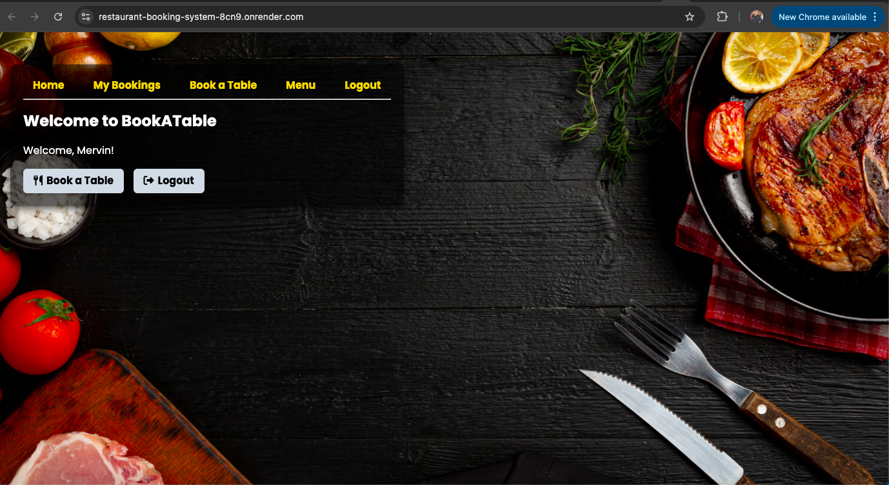

- Welcomes users with background imagery
- Buttons to Book table, Login or Register
- Static menu preview section

### **2. Register **

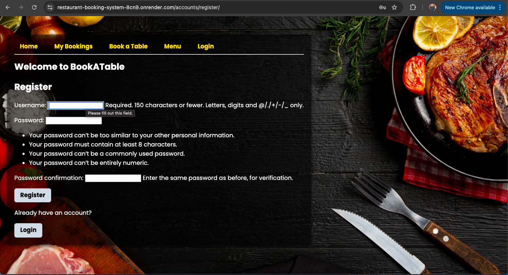

- New users create accounts
- Redirects to login upon success

### **3. Login **

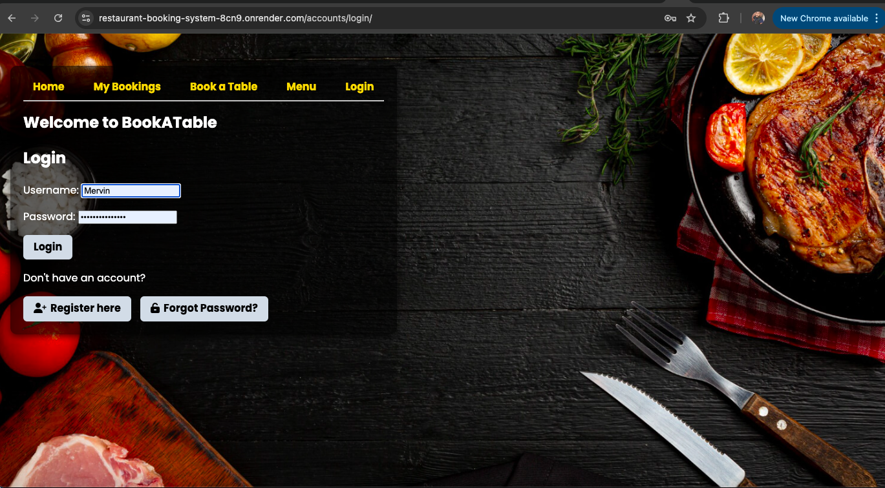

- Users log in to access dashboard
- Navbar dynamically updates to reflect user state

### **4. Book a Table **

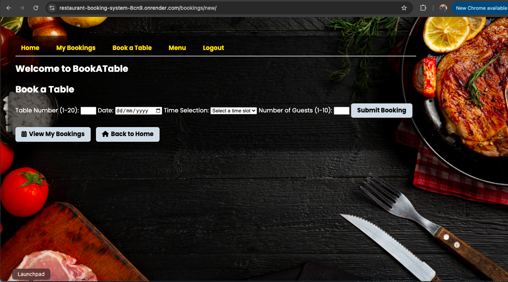

- Booking form with date, time and guests
- Form validation ensures future date/time
- Success message and redirect after booking

### **5. My Bookings **

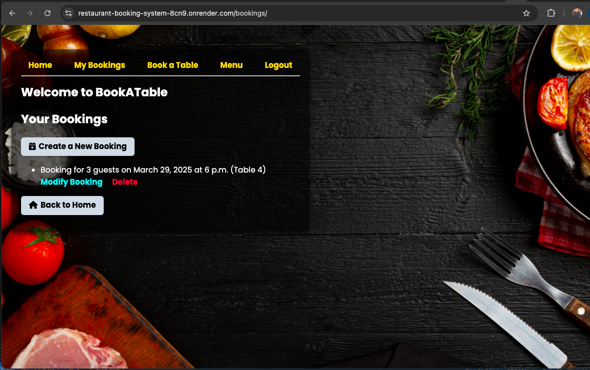

- Shows current user's bookings
- Options to edit or cancel the booking

### **6. Edit Booking **

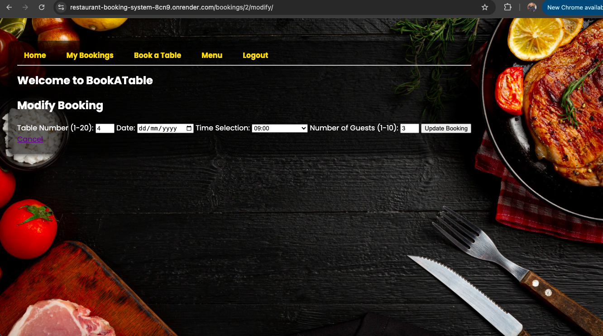

- Booking form prefilled with current info
- Re-validates on submission

### **7. Admin Panel **

- Superuser login required
- View all user data and bookings

---

## User Flow Examples

**User A - New User** - 👤

- Visits Homepage → Registers → Logs in → Books A Table → Views and updates booking → Logs out

**User B - Returning User:** 👤

- Logs in → Goes directly to "My Bookings" → Cancels a booking → Makes a new booking → Logs out

**Admin User:** 👨‍💻

- Logs into '/admin/' → Views all bookings → Deletes Duplicates or inappropriate entries

---

## Wireframes

Although this is not the final mockup of my project this is a mockup of what I presumed the project would
look like. I had no prior knowledge of how Django makes things much more easier and that visually the project
would take on an entirely different appearance.

###

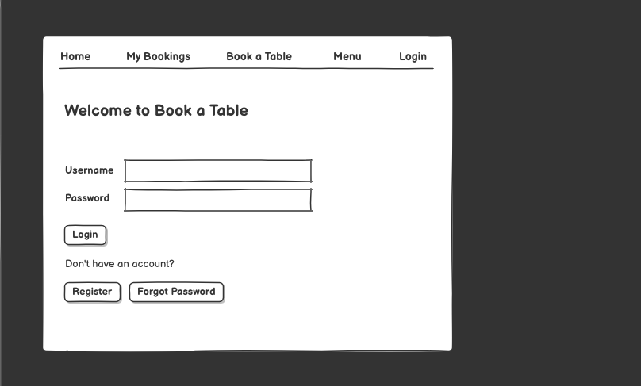
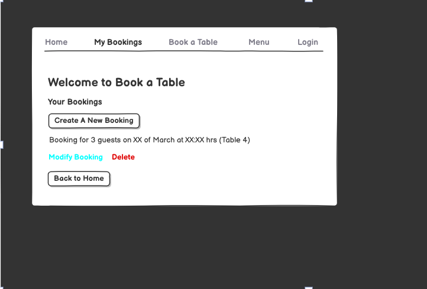
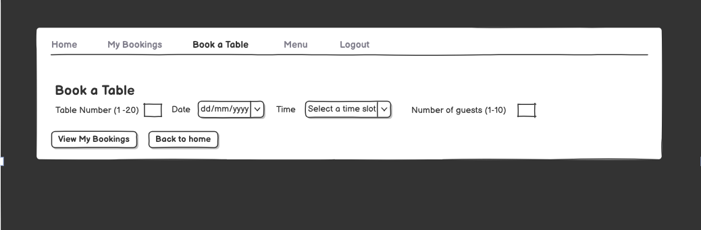
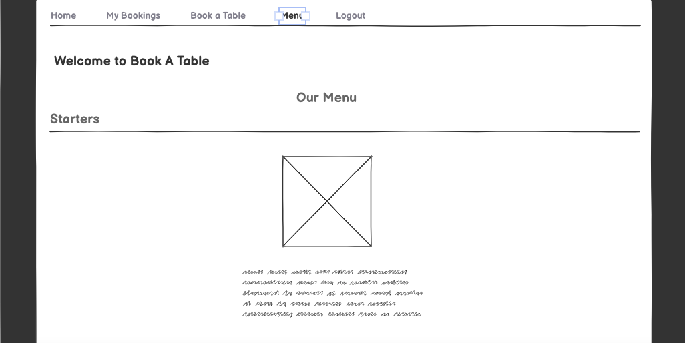
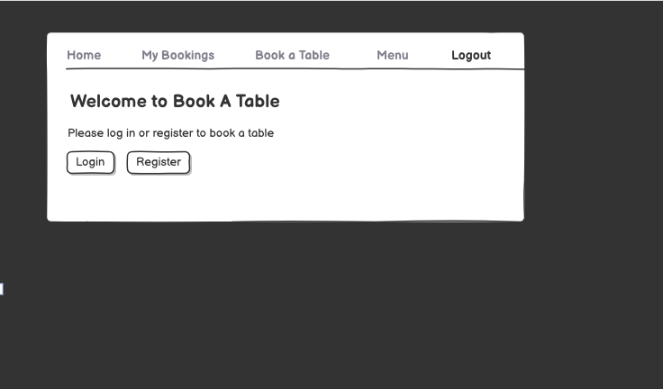

---

## Design & Color Scheme

The user interface of the **BookATable** restaurant booking system is designed to create a premium, elegant, and appetizing experience. The visual design choices were carefully made to reflect a fine dining atmosphere — sophisticated, welcoming, and easy to use.

### 🎨 Color Scheme

Colors were chosen to balance luxury with usability. The application uses a dark theme with golden highlights, vibrant accents, and warm, organic tones.

#### 🌈 Visual Color Palette

<table>
  <thead>
    <tr>
      <th>Color Name</th>
      <th>Color Preview</th>
      <th>Hex Code</th>
      <th>Description</th>
    </tr>
  </thead>
  <tbody>
    <tr>
      <td>Black</td>
      <td></td>
      <td><code>#000000</code></td>
      <td>Main background for a dark, elegant theme</td>
    </tr>
    <tr>
      <td>Golden Yellow</td>
      <td></td>
      <td><code>#FFD700</code></td>
      <td>Used for navigation highlights and buttons</td>
    </tr>
    <tr>
      <td>Tomato Red</td>
      <td></td>
      <td><code>#FF6347</code></td>
      <td>Accent color in food imagery for appetite appeal</td>
    </tr>
    <tr>
      <td>Dark Red</td>
      <td></td>
      <td><code>#8B0000</code></td>
      <td>Rich tone to support savory food visuals</td>
    </tr>
    <tr>
      <td>White</td>
      <td></td>
      <td><code>#FFFFFF</code></td>
      <td>Text color on dark backgrounds for clarity</td>
    </tr>
    <tr>
      <td>Dark Wood 1</td>
      <td></td>
      <td><code>#2F2F2F</code></td>
      <td>Represents deep wooden texture background</td>
    </tr>
    <tr>
      <td>Dark Wood 2</td>
      <td></td>
      <td><code>#4B3621</code></td>
      <td>Enhances warmth and rustic ambiance</td>
    </tr>
    <tr>
      <td>Herb Green</td>
      <td></td>
      <td><code>#228B22</code></td>
      <td>Used in garnish imagery to add freshness</td>
    </tr>
  </tbody>
</table>

### 🔤 Typography

Typography in BookATable was chosen for readability, elegance, and a clean visual hierarchy.

- **Primary Font**: `Poppins`, `Roboto`, or a clean sans-serif stack — chosen for its modern, rounded appearance and excellent readability at all sizes.
- **Headings**: Bold and uppercase styling helps users quickly identify page sections like “Book a Table” or “My Bookings”.
- **Body Text**: Medium weight, balanced spacing, and high contrast with the background ensures easy scanning and clarity, even in low-light environments (like in-restaurant use).
- **Button Text**: Simple, short labels in uppercase with bold weight to communicate clear actions (e.g., `BOOK NOW`, `LOGIN`).

The overall typography promotes a balance between style and function, contributing to a refined yet intuitive user interface.

### 📐 Layout & Structure

The layout emphasizes clarity and ease of use across all screen sizes.

- **Responsive Design**: Fully optimized for mobile, tablet, and desktop use. Key actions (like booking or viewing reservations) are always easy to access.
- **Centered Content**: Pages like the login screen and booking form are centered to create a focused user experience.
- **High Visual Hierarchy**: Use of clear headings, visual separation of components, and prominent call-to-action buttons enhances usability.
- **Use of Imagery**: Large, high-quality food images are used on the homepage to create a strong first impression and evoke appetite.
- **Consistent Navigation**: The top navigation bar is fixed, allowing quick access to main sections like `Home`, `Menu`, and `My Bookings`.

The layout aligns with the principles of modern UX — clarity, minimal friction, and user-first design — all while maintaining a strong brand personality.

---

## Technologies Used

- **Python 3.12**
- **Django 5.1.6**
- **HTML5,CSS3, Javascript**
- **Gunicorn**
- **WhiteNoise**
- **PostgreSQL**
- **Render for deployment**
- **GitHub for version control**

---

## Testing

Through testing was carried out throughout the development lifecycle of the Restaurant Booking System.
Although automated testing using Django's 'TestCase' was not implemented, **manual testing was performed
consistently and deliberately at every stage** of development.

### Manual Testing Overview

- Every Major feature was tested upon implementation, with particular emphasis on:
  - **User authentication flow** (registration, login, logout, session control).
  - **Booking system** (create, update, delete, and date/time validation).
  - Navigation consistency and dynamic navbar rendering.
- **Javascript validation** was also tested to ensure users could not book past dates or submit incomplete forms.
- **Form validations** were verified for both frontend (js) and backend (Django).

### Final Manual Testing Rounds

Two rounds of full manual testing were conducted during the final stages of the project to ensure stability and completeness:

- The first round focused on catching logic errors, display issues, and broken links.
- The second round verified correct user flow, data handling, and successful deployment integration on Render.

### Manual Testing Table

<!DOCTYPE html>
<html lang="en">
<head>
  <meta charset="UTF-8">
  <title>Manual Testing Report</title>
  
</head>
<body>

  <h2> Manual Testing Report</h2>

  <table>
    <thead>
      <tr>
        <th>Feature Tested</th>
        <th>Test Input</th>
        <th>Expected Result</th>
        <th>Actual Result</th>
        <th>Pass/Fail</th>
      </tr>
    </thead>
    <tbody>
      <tr>
        <td>User Registration</td>
        <td>Valid username, email password</td>
        <td>Account created and user redirected to homepage</td>
        <td>Account created successfully</td>
        <td class="pass">Pass</td>
      </tr>
      <tr>
        <td>User Login</td>
        <td>Correct credentials</td>
        <td>User logged in and redirected to homepage</td>
        <td>Works as expected</td>
        <td class="pass">Pass</td>
      </tr>
      <tr>
        <td>Login</td>
        <td>Invalid credentials</td>
        <td>Error message shown: “Invalid username or password.”</td>
        <td>Error message displayed</td>
        <td class="pass">Pass</td>
      </tr>
      <tr>
        <td>Booking Form Submission</td>
        <td>Table = 5, Date = Tomorrow, Time = 12:00, Guests = 4</td>
        <td>Booking created and visible in bookings list. Success message confirmed on screen</td>
        <td>Booking saved correctly</td>
        <td class="pass">Pass</td>
      </tr>
      <tr>
        <td>Booking Form (Invalid)</td>
        <td>Table = 25, Date = Today, Guests = 10</td>
        <td>Input validation blocks submission with alert message: “Bookings must be made at least one day in advance.”</td>
        <td>Validation works</td>
        <td class="pass">Pass</td>
      </tr>
      <tr>
        <td>Forgot Password</td>
        <td>Valid email entered</td>
        <td>Confirmation message: “A password reset link has been sent to your email.”</td>
        <td>Confirmation shown. Green success message</td>
        <td class="pass">Pass</td>
      </tr>
      <tr>
        <td>Forgot Password</td>
        <td>Incorrect email entered</td>
        <td>Confirmation message: “No account found with that email.”</td>
        <td>Error message shown</td>
        <td class="pass">Pass</td>
      </tr>
      <tr>
        <td>Responsive Design</td>
        <td>Scale screen to mobile width</td>
        <td>Navbar stacks vertically and buttons span full width</td>
        <td>Layout adjusts correctly</td>
        <td class="pass">Pass</td>
      </tr>
      <tr>
        <td>Form Validation</td>
        <td>Leave all booking fields empty and submit</td>
        <td>Alert: All fields must be filled</td>
        <td>Alert triggered</td>
        <td class="pass">Pass</td>
      </tr>
      <tr>
        <td>Double Booking Prevention</td>
        <td>Table = 3, Date = 2025-03-15, Time = 13:00, Guests = 4</td>
        <td>Message stating that booking has been made on this date and table</td>
        <td>Booking prevented successfully</td>
        <td class="pass">Pass</td>
      </tr>
    </tbody>
  </table>

</body>
</html>

> \_Note: Testing logs and outcomes were also documented on the [GitHub Kanban Board](#kanban-board).\*

---

## Code Compliance & Validation

Through the development of this project, steps were taken to ensure the codebase adhered to best practices and modern standards

✅ **Python (PEP8)**

All Python code was writtern with adherence to PEP8 guidelines using:

Built-in linting tools in VS-Code

Code was checked for:

- **Line Length**
- **Function/class naming conventions**
- **Indentation and whitespace**
- **Unused imports and variables**

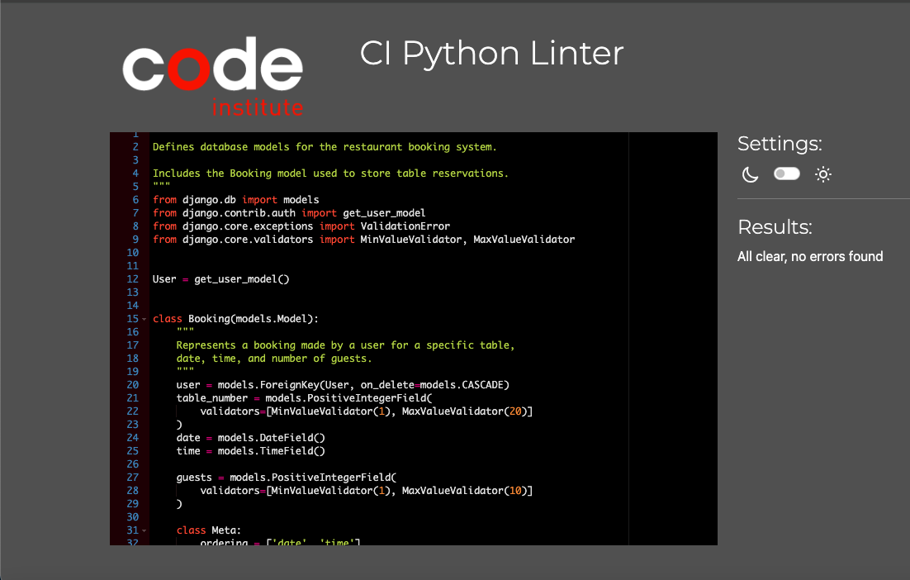

❌ **CSS Validator Jigsaw**

Code was checked for:

- **Syntax Errors** which there are none
- Vendor prefixes used when necessary
- **Valid media queries** and responsive rules

Only one error which appears to have no conflicts with the functionality of the app.
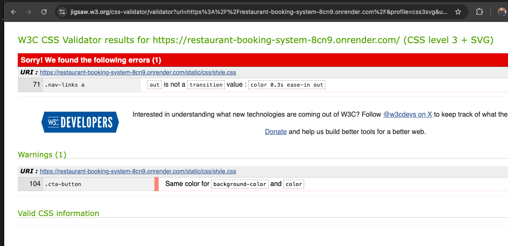

❌ **W3C HTML Validator**

- On passing the code through the validator the returned results are as follows:

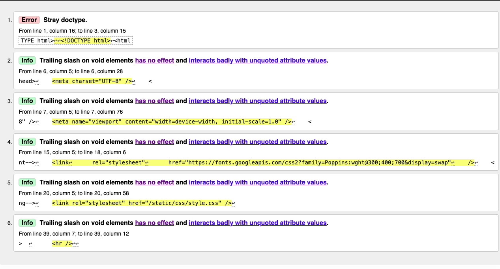

✅ I use a trailing slash because I run my HTML markup through a formatting tool that’s hardcoded to add trailing slashes to all void-element start tags, without any option for me to prevent the tool from doing that, namely Prettier which is known for giving
trailing slashes to void elements. It can be avoided and it is currently having no effect on the front end however for future best
practice it may be best to save code without formatting.

❌ **Javascript (JShint)**

- Javascript used for form validation was checked via:
- **JSHint**
- Focused on valid syntax and function usage -'let' is available in ES6 (use 'esversion: 6') or Mozilla JS extensions (use moz).
- Undefined variables - Only three unuses variables
- Missing semicolons - None

Although some JavaScript errors were noted, they were not addressed until the final stages of the project. Despite this, no issues have
been observed during local development, which has provided peace of mind. If there were more time, I would have refined code further to
eliminate these minor warnings. However as the focus of this project was to deliver a minimum viable product, my priority was ensuring functionality and user experience. Which I feel the project achieves fairly.

---

## Setup & Installation

1. **Clone the Repository**

Begin by cloning the repository to your local development environment this is done in the terminal.

- git clone https://github.com/DeanA1985/Restaurant-Booking-System.git
- cd Restaurant-Booking-System

2. **Create & Activate Virtual Environment (venv)**

Set up a virtual environment to isolate dependencies.

- python3 -m venv venv

3. **Install Dependencies**

Install al Python dependencies listed in requirements.txt

- pip install -r requirements.txt

4. **Environment Variables**

Create a .env file in the root of your project and define the following keys:

- DEBUG=True
- SECRET_KEY =your_secret_key_here
- ALLOWED_HOSTS=127.0.0.1,localhost
- DATABASE_URL=sqlite:///db.sqlite3

- For deployment, ensure that DEBUG=False and use your production database URL e.g., from Render.

5. **Apply Migrations**

Set up your local databases by running

- python manage.py makemigrations
- python manage.py migrate

6. **Create a Superuser**

- python manage.py createsuperuser

7. **Collect Static Files**

Collect all static files into staticfiles/directory:

- python manage.py collectstatic

8. **Run the Application Locally**

Start the development server:

- python manage.py runserver

visit http://127.0.0.1:8000/ in your browser to view the site

---

## Deployment

### Why I Chose Render Instead of Heroku

When it came to deploying the Restaurant Booking System, Render was selected as the hosting platform over Heroku,
and this decision was made based on a number of practical, technical, and experiential reasons . While Heroku had
once been a go to for me, changes in the pricing and feature availability significantly impacted the appeal for small
scale deployments.

### Challenges Faced with Heroku

Despite having experience with Heroku in my third Python Project I encountered some critical obstacles during the planning
and early testing phase of deployment:

- Free Tier Removed: Heroku deprecated their free plan in 2022, meaning PostgreSQL databases and dynos (web processes)
  could no longer be hosted for free. This made Heroku inaccessible for projects requiring persistent databases and continuous
  access without incurring costs.

- Add-Limitations: PostgreSQL previously available as a simple add-on, now required a credit card and a paid subscription,
  complicating setup for a demo portfolio project.

- Dormant Dynos: When Heroku's free tier existed apps would sleep after inactivity, causing slow load times when accessed again.
  Render's free web services stay **always on** improving the performance and user experience.

### Why Render was a better fit

Render emerged as a much stronger candidate during testing for several reasons:

- True Free Hosting
- Simple GitHub Integration
- Built in PostgreSQL
- Reliable Builds and Logs
- Static File Support
- Live Shell Access

### Deployment Frustrations turned into Learning Curves

Initially a few mishaps were made environment variables werent fully configured in Heroku and the database was not correctly
linked, which caused auth_user errors on user registration. There were also issues with static files not rendering, which were
eventually resolved by:

- Adding WhiteNoiseMiddleware
- Running collectstatic
- Checking folder structure (static vs staticfiles)

Ultimately, these challenges enhanced understanding of production environments and reinforced best practices like .env management,
using gunicorn and database abstraction.

### The Deployment Process

The Restaurant Booking System is deployed using Render for hosting both the Django application and PostgreSQL database.

**Steps to Deploy:**

1. Push to GitHub: Ensure you project is pushed to GitHub (e.g., Restaurant-Booking-System.)

2. Create a New Web Service on Render

- Go to the Render Dashboard
- Click "New Web Service"
- Choose "From a Git Repository
- Connect from your Github Account and select your repository

3. Configure the Web Service

Fill i the following fields:

- **Name:** restaurant-booking-system
- **Environment:** Python 3
- **Build Command:** pip install -r requirements.txt

- **Start Command:** gunicorn restaurant_booking.wsgi:application

* You may need to change restaurant_booking to match the name on your Django project root folder.

4. Add Environmental Variables
   Click "Advanced">"Add Environment Variables", and add the following

   - SECRET_KEY - your django secret key found in settings.py
   - DEBUG - FALSE
   - ALLOWED_HOSTS - restaurant-booking-system-xxxx.onrender.com
   - DATABASE_URL - From Render;s database tab

   * Replace xxxx with your actual Render subdomain

5. Create a PostgresSQL Database

   - Go to Render Dashboard> "New +"> "PostgreSQL"
   - Give it a name (e.g restaurant_db)
   - Once created, go to the database "Connection" tab
   - Copy the Internal Database URL and paste it into the Database_URL env variable in your web service,

6. Update Django Settings

- Install and configure dj_database_url and decouple in your settings
- Update DATABASES to use DATABASE_URL
- Add:

  import dj_database_url
  from decouple import config

  DATABASES = {
  'default': dj_database_url.parse(config(DATABASE_URL'))
  }

7. Collect Static Files

   In the terminal

   - python manage.py collectstatic

**Make sure WhiteNoiseMiddleware is enabled in settings.py**

8. Run Migrations and Create Superuser

   In Render's **Shell tab**

   - python manage.py migrate
   - python manage.py createsuperuser

9. Visit Live Site

Your app should now be live at: https://restaurant-booking-system-xxxx.onrender.com

---

## Bugs & Fixes

Throughout development and deployment, several bugs were encountered and resolved. Below is a summary of the most notable
issues and how they were overcome.

1. **Git Remote Conflicts**

- **Issue:** An Existing Remote (Heroku) was still set on the local Git repo, whichcaused errors when trying to add Render's Github remote.

- **Fix:** The Heroku remote was removed using: git remote remove heroku, then the correct GitHub remote was confirmed with git.remote -v.

2. **Disallowed Host Error**

- **Issue:** On intital Render deployment, the app craskhed with a DisallowedHost error.

- **Fix:** The live render url : restaurant-booking-system-8cn9.onrender.com was added to ALLOWED_HOSTS in the .env file and environment
  settins on Render

3. **502 Bad Gateway**

- **Issue:** A generic 502 error appeared due to missing collectstatic setup and incorrect Gunicorn command.

- **Fix:** Added whitenoise.middleware.WhiteNoiseMiddleware to the middleware stack, and collected staticfiles via python manage.py collectstatic in the terminal.

4. **Database Migration Issues**

- **Issue:** Registering or logging in caused errors to missing PostgreSQL tables (auth_user not found).

- **Fix:** Ran migrations and created a superuser via the Render shell: python manage,py migrate, python manage.py createsuperuser

5. **Static Files Not Rendering**

- **Issue:** CSS appeared but images like background images were missing.

- **Fix:** - Ensured correct folder structure (static/images/restaurantbg.jpg) - Confirmed STATICFILES_DIRS and STATIC_ROOT were correctly configured. - Re collected static files with : python manage.py collectstatic

6. **env Values not Detected**

- **Issue:** Environment variables like DEBUG, ALLOWED_HOSTS or DATABSE_URL weren't being picked up

- **Fix:** Double checked variable names a d values in Render's environment settings

---

## Kanban Board

To ensured structured planning and iterative development, a Kanban board was utilised throughout the project via GitHub Projects.

The board was useed to break down the project into manageable taks and track progress across three key stages:

- **To Do:** Tasks yet to be started included feature planning, design ideas and setup goals.
- **In Progress:** Active tasks under development, such as implementing user authentication or setting up the booking model.
- **Done:** Completed features and resolved bugs, including deployment form validation and testing.

Using the board ensured that all aspects of the project were visible, priortised and accounted for - from MVP planning to post
deployment cleaning up.

[Restaurant Booking System - Github Kanban Board](https://github.com/users/DeanA1985/projects/2/)

---

## Credits

Images in this project were taken from freepik which is a free resource image database
